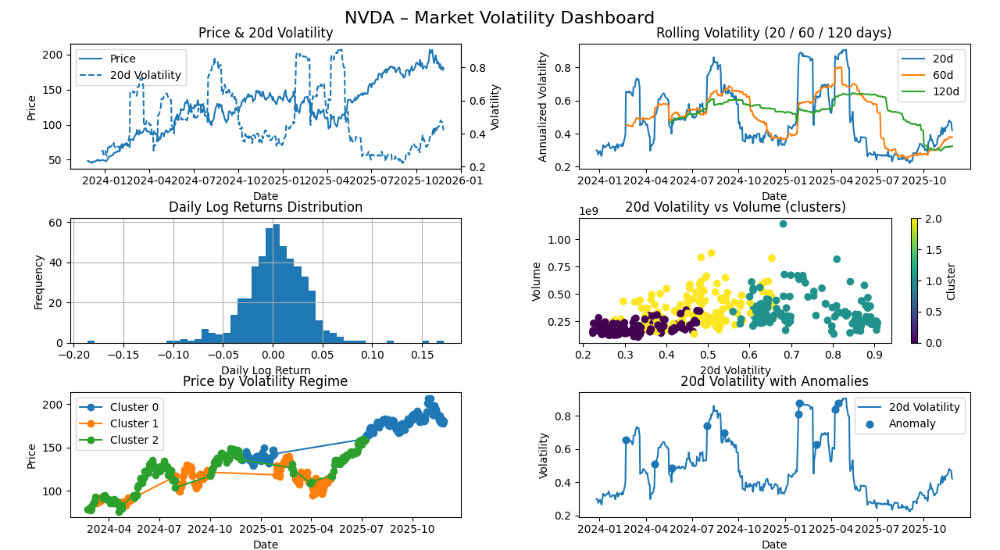

# Market Volatility Dashboard

An interactive Python tool that lets you type in a stock ticker (e.g. `AAPL`, `NVDA`) and get a **one-page dashboard** showing:

- Price vs. volatility over time  
- Short / medium / long-term volatility  
- Daily return distribution  
- Volatility vs. trading volume  
- Volatility regimes (calm vs. turbulent periods)  
- Statistically unusual (“anomaly”) days  

All of this runs locally from the terminal using Python and `matplotlib`.

---

## What This Project Does

1. You enter a stock ticker in the terminal.
2. The program downloads historical price data.
3. It calculates daily returns and several volatility measures.
4. It applies simple machine-learning models to:
   - group days into **volatility regimes**, and  
   - detect **abnormal volatility days**.
5. It plots everything in a **3×3 dashboard** in a single window.

---

## Requirements

- Python 3.8+
- `pip` (Python package manager)

Python libraries used:

- `yfinance`
- `pandas`
- `numpy`
- `matplotlib`
- `scikit-learn`

They’re all listed in `requirements.txt`.

---

## Installation

From the project root:

```bash
# (optional but recommended) create a virtual environment
python -m venv .venv
# activate it
# Windows:
.venv\Scripts\activate
# macOS / Linux:
source .venv/bin/activate

# install dependencies
pip install -r requirements.txt
